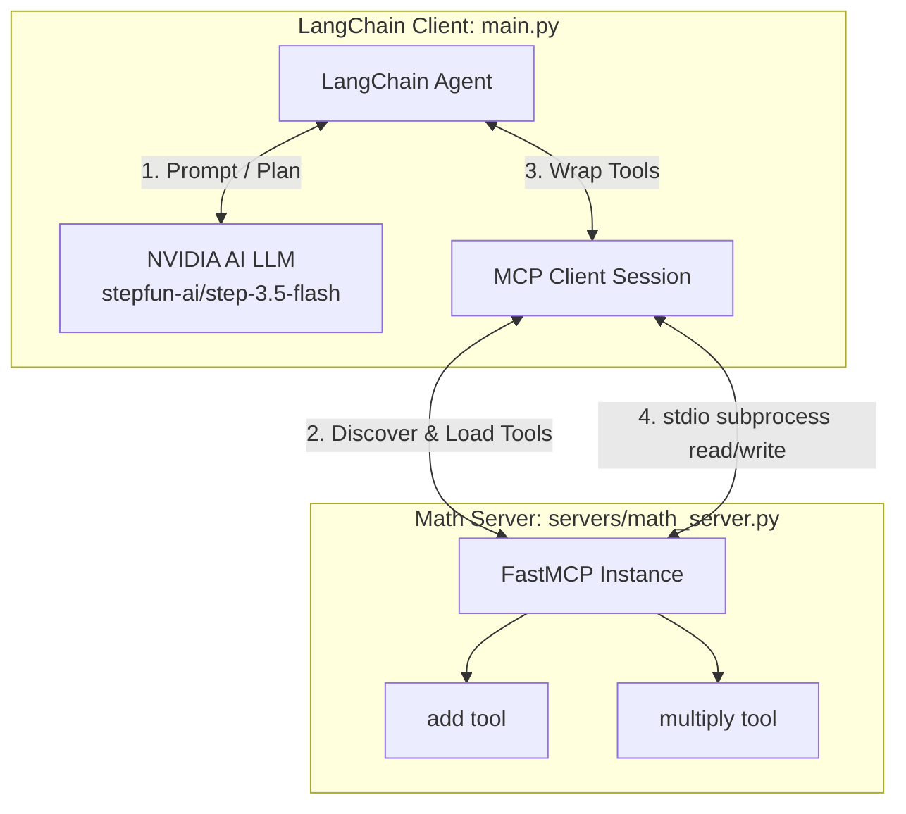

# 🔌 MCP Crash

A demonstration of the **Model Context Protocol (MCP)** integrated with **LangChain** and **NVIDIA AI NIM Endpoints**. 

This repository showcases how to dynamically load custom tools from isolated MCP servers into a LangChain agent using the `langchain-mcp-adapters` framework, all managed seamlessly by the ultra-fast Python package manager `uv`.

---

## 🚀 Key Features

* **Dual MCP Server Transports**: 
  * **Stdio Transport**: A math helper server running over standard input/output (`math_server.py`).
  * **SSE Transport**: A weather status server running over Server-Sent Events HTTP transport (`weather_server.py`).
* **Dynamic Tool Integration**: Automatically loads tools from remote/subprocess MCP servers as standard LangChain tools using `langchain-mcp-adapters`.
* **NVIDIA AI Integration**: Leverages the high-performance `ChatNVIDIA` model (`stepfun-ai/step-3.5-flash`) for intelligent reasoning, tool calling, and output synthesis.
* **Modern Python Tooling**: Uses `uv` for lightning-fast virtual environment management and package installation.

---

## 🏛 Architecture Overview

The following diagram illustrates how the LangChain client connects to the FastMCP server, fetches available tools, runs the LLM planning loop, and invokes tools over a standard input/output (stdio) pipe:



---

## 📁 Repository Structure

```directory
mcp-crash/
├── main.py                 # Main entrypoint: sets up MCP client, agent, and runs query
├── pyproject.toml          # Project dependencies (LangChain, python-dotenv, etc.)
├── uv.lock                 # Lockfile ensuring strict, reproducible dependencies
├── .env.example            # Template for environment variables (API keys)
├── .env                    # Local environment secrets (ignored by git)
└── servers/                # Custom MCP Servers
    ├── __init__.py         # Package initialization
    ├── math_server.py      # Stdio FastMCP Server exposing arithmetic tools
    └── weather_server.py   # SSE (Server-Sent Events) FastMCP Server exposing weather info
```

---

## ⚙️ Prerequisites & Setup

### 1. Install `uv`
This project relies on `uv` for python virtualenv and package management. If you don't have it installed, run:
```bash
# On macOS/Linux
curl -LsSf https://astral.sh/uv/install.sh | sh
```

### 2. Clone and Setup Environment
Clone the repository, navigate into the directory, and copy the `.env.example` file to `.env`:
```bash
cp .env.example .env
```

### 3. Add Your Secrets
Open `.env` and fill in your API credentials:
```env
# Required for LangChain Tracing (Optional but highly recommended)
LANGSMITH_TRACING=true
LANGSMITH_ENDPOINT=https://api.smith.langchain.com
LANGSMITH_API_KEY=your_langsmith_api_key_here
LANGSMITH_PROJECT=mcp-crash-course

# Required for execution
NVIDIA_API_KEY=your_nvidia_api_key_here
```

---

## 🛠 Running the Project

### Running the Math Agent (Stdio Subprocess)

The main workflow (`main.py`) launches the math server as a stdio subprocess, discovers its tools, bundles them into a LangChain agent, and solves an arithmetic expression using LLM-directed reasoning.

Run the client agent using `uv run`:
```bash
uv run main.py
```

#### Under the Hood:
1. **Launch**: `main.py` spins up `servers/math_server.py` inside a sub-process using `uv run servers/math_server.py`.
2. **Tool Discovery**: `load_mcp_tools(session)` queries the server for tools. The server returns JSON descriptions of `add` and `multiply`.
3. **Reasoning Loop**: The LangChain agent receives the user prompt: `"What is 54 + 2 * 3?"`.
4. **Execution**: The LLM determines it needs to call `multiply(2, 3)` first, sends the command over stdio, gets `6`, then calls `add(54, 6)` over stdio, and outputs the final result: `60`.

---

## 🧩 Exploring the MCP Servers

This repository includes two servers built using the high-level `FastMCP` framework:

### 1. Math Server (`servers/math_server.py`)
Runs over **Stdio transport** (great for local CLI utilities and embedded agents).
Exposes two basic arithmetic helper tools:
* `add(a: int, b: int) -> int`
* `multiply(a: int, b: int) -> int`

### 2. Weather Server (`servers/weather_server.py`)
Runs over **SSE (Server-Sent Events) transport** (perfect for network-isolated or microservices-based agentic infrastructures).
Exposes:
* `get_weather(location: str) -> str`

To start the weather server directly (exposing a web endpoint):
```bash
uv run servers/weather_server.py
```

---

## ✍️ Extending and Writing Your Own Tools

Adding new tools is incredibly easy with FastMCP. Simply import `FastMCP`, declare a server, and decorate your python functions with `@mcp.tool()`.

### Example: Adding a custom tool in `servers/math_server.py`
Add this snippet to create a subtraction tool:

```python
@mcp.tool()
def subtract(a: int, b: int) -> int:
    """Subtract b from a"""
    return a - b
```

The next time `main.py` is executed, the LangChain adapter will automatically detect and load `subtract` as an available tool without needing any changes to the client-side code!

---

